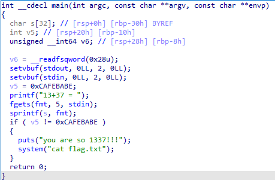

# 13+37 

### Analyze 

Review xem qua cơ bản thì đây là một file ELF 64-bit không bị stripped và full mitigation. Chạy thử thì bài này sẽ hỏi mình 13+37, nhập đáp án vào thì sẽ không có chuyện gì xảy ra hết. 

Mở ida để review source code 

Thì source code khá là đơn giản. Đầu tiên chương trình in ra "13+37 = " sau đó cho chúng ta nhập đáp án thông qua biến `fmt(nằm ở bss với size 1344)`, vì chỉ cho nhập tối đa `5 bytes` vậy nên sẽ không có hiện tượng `buffer overflow` xảy ra ở đây. Sau đó biến `s` sẽ bị ghi đè thông qua biến fmt bằng hàm `sprintf`. Và nếu biến `v5(đã được khởi tạo trước đó với giá trị 0xcafebabe)` khác với `0xcafebabe` thì sẽ chạy hàm bên trong, và nó chính là thứ mà chúng ta cần đó là `system("cat flag.txt")`. Vậy để có thể thỏa mãn thì chúng ta phải ghi đè biến `v5` thành một giá trị khác với `0xcafebabe`, có thể là 0 hoặc 1 hoặc 0xdeadbeef hoặc bất cứ gì mà bạn có thể ghi đè.
### Tìm lỗi của chương trình
Vậy bug nằm ở đâu? 

Nếu như các bạn đã học sơ qua về pwn thì sẽ ít nhiều nghe đến lỗi `format string`. Ở bài viết này mình sẽ không nói đến technique `format string` mà mình chỉ hướng dẫn cách tận dụng lỗi `format string` để giải quyết vấn đề trong bài này.

Bug nó nằm tại hàm `sprintf(s,fmt)` chính là bug `format string` mà mình nói ở trên. 
### Exploit
Vậy bài này mình sẽ sử dụng lỗi `format string` để ghi đè 32 bytes của biến `s` để nó tràn xuống biến `v5` (vì biến v5 nằm ngay dưới biến s[32]) 

Làm sao để ghi đè và tận dụng lỗi như thế nào?
Lỗi `format string` có 1 tính năng rất là hay đó là nếu bạn nhập vào `%c` thì nó sẽ ghi đè 1 khoảng trắng vào biến `s`, ví dụ nếu mình nhập `%8c` thì nó sẽ ghi đè 8 ký tự trắng vào biến `s`. Áp dụng vào bài trên thì ta chỉ cần nhập `%32c` là nó đã có thể tràn 1 byte ký tự trắng xuống biến v5 là ta đã thỏa mãn hàm if để in ra flag. 

Nếu như bạn là người mới chưa hiểu rõ về hai bug `format string` và `buffer overflow` thì bạn có thể tham khảo link ở bên dưới

`buffer overflow` : https://www.youtube.com/watch?v=T03idxny9jE&list=PLhixgUqwRTjxglIswKp9mpkfPNfHkzyeN&index=13&ab_channel=LiveOverflow

`format string` : https://www.youtube.com/watch?v=0WvrSfcdq1I&ab_channel=LiveOverflow
